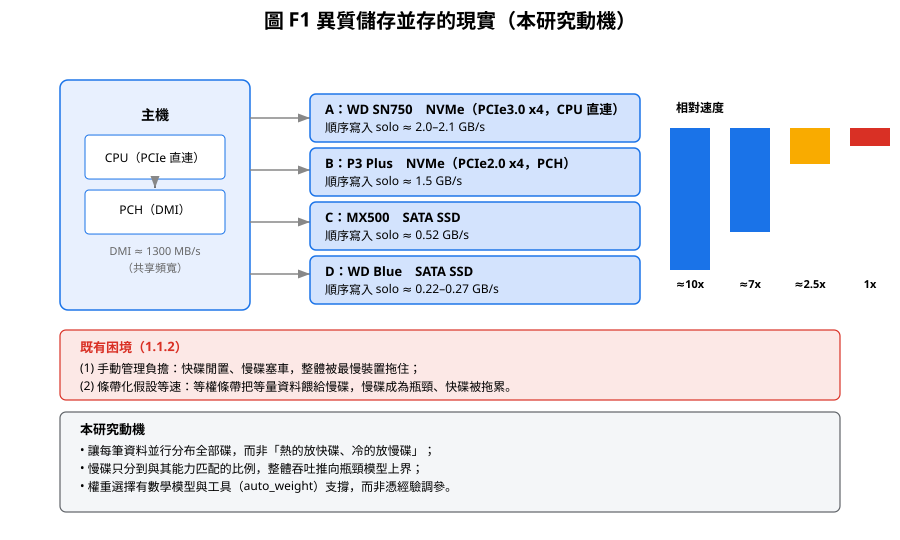

# 第一章 緒論

> **本章導讀**：1.1 說明研究動機（異質碟共存與既有困境）；1.2 定義四個子問題
> P1–P4 與其驗證方式；1.3 界定研究範圍與名詞；1.4 列出五項貢獻；1.5 以
> 可追溯性矩陣串起「目標 → 設計 → 實作 → 驗證」的全文地圖；1.6 說明論文架構。

## 1.1 研究背景

### 1.1.1 異質儲存裝置並存的現實

現代電腦系統中，單一主機同時掛載多顆**性能差異極大**的儲存裝置已是常態，而非特例。
以本論文實驗平台的實際裝置為例：

| 裝置 | 介面 | 順序寫入（實測 solo） | 相對最慢碟 |
|------|------|----------------------|------------|
| WD SN750 NVMe | PCIe3.0 x4（CPU 直連） | ~2.0–2.1 GB/s | ~10 倍 |
| P3 Plus NVMe | PCIe2.0 x4（PCH） | ~1.5 GB/s | ~7 倍 |
| MX500 SATA SSD | SATA 3 | ~0.52 GB/s | ~2.5 倍 |
| WD Blue SATA SSD | SATA 3 | ~0.22–0.27 GB/s | 1 倍 |

若再加入傳統機械硬碟（順序寫入常見僅 ~0.1–0.2 GB/s），快慢差距可達**數十倍**。
這些裝置之所以並存，是硬體、成本與使用情境共同作用的結果：

> **圖 F1 說明**：左為本實驗平台主機示意（CPU 直連 vs PCH/DMI），右為四碟的
> 相對速度（最快 ≈10x 最慢）。下方兩條帶分別是既有困境與本研究動機。

- **成本**：每單位容量的價格 NVMe > SATA SSD > HDD。預算有限時，使用者傾向
  「少量高速 NVMe + 大量低價慢碟」的組合，而非清一色高速碟。
- **既有硬體**：主機板提供的介面資源有限且異質——CPU 直連的 PCIe 通道數量固定、
  南橋（PCH）透過 DMI 上行共享頻寬、SATA 介面容量遠低於 PCIe。已經插好的碟
  不會因為「換了更快的碟」而消失，新舊裝置自然混存。
- **用途差異**：熱資料與冷資料、隨機小 IO 與大塊順序 IO、重視延遲的應用與重視
  容量的備份——不同負載對裝置的需求本就不同，異質組態在某種程度上是合理選擇。

### 1.1.2 異質環境下的既有困境

作業系統（以及其上層的檔案系統、資料庫、應用程式）預設把每一顆磁碟視為
**獨立、且性能對稱**的裝置。這帶來兩個實際問題：

1. **手動管理負擔**：使用者必須自行決定每份資料放哪顆碟。資料分布一旦不均，
   快的碟閒置、慢的碟塞車，整體效能被最慢的裝置拖住；而手動搬移資料既耗時又容易出錯。
2. **條帶化假設失準**：為了讓多碟協同工作，軟體常採用**條帶化（striping）**——把資料
   依固定 chunk 輪流分配到各碟。經典的條帶化（硬體 RAID 0、Linux `dm-striped`、LVM striped）
   都**假設各碟等速**。在異質碟上，等權條帶會把固定比例的資料（等量）餵給慢碟，
   慢碟成為瓶頸、快碟被拖累：即使快碟只分到一小部分資料，整條 I/O 管線的吞吐
   也被慢碟的部分寫入時間所限制。

### 1.1.3 Device Mapper 與既有 target

Linux 提供了 **Device Mapper**（dm）這個可堆疊的區塊裝置框架，允許以軟體方式把多顆
實體裝置組合成一個邏輯裝置（詳見第二章）。既有 target 各自解決一部分問題：

- `linear`：把多碟**線性拼接**成大容量——但不分散 I/O，單碟忙碌時其他碟閒置；
- `striped`：**等權條帶**——假定各碟等速，異質碟下最慢碟成為瓶頸；
- `mirror`：**同步鏡像**——追求可靠性而非性能；
- `cache`：以 SSD 為快碟、HDD 為慢碟的**兩層快取**——本質是「熱資料置放」而非
  「並行吞吐分配」。

**沒有一個既有 target 針對異質碟的「性能差異」做權重化分配**。等權條帶把「性能差異」
視為不存在；兩層快取把「性能差異」只簡化成快/慢兩檔，且依賴快取命中率。

### 1.1.4 研究動機

本研究因此提出 **TieredVol**：一個以**加權條帶化（weighted striping）**為核心的
dm target。管理者為每顆碟指定與其性能**成正比**的權重（例如 10:5:2:1），
TieredVol 依權重把 I/O 分散到各碟，使得：

- **每一筆資料都並行分布到全部碟**，而非「熱的放快碟、冷的放慢碟」——從根本
  避免慢碟獨扛整串寫入；
- **慢碟只分到與其能力匹配的比例**，快碟多做事、慢碟少做事，整體吞吐被推向
  「瓶頸模型」決定的理論上界；
- 權重選擇有**數學模型與工具**支撐，而非憑經驗調參。

## 1.2 問題定義

本論文要解決的核心問題可拆成四個子問題，各自有明確的驗證方式：

**P1 加權條帶（weighted striping）與確定性映射。**
給定 n 顆碟與權重向量 W=(w₁,…,wₙ)、chunk 大小 c，如何把邏輯位址依權重均分到各碟？
映射必須同時滿足：
- **確定性**：同一邏輯位址永遠落在同一碟的同一位置（可重現、可驗證）；
- **O(1)**：以常數時間的數學運算完成（無查表、無索引），使熱路徑無鎖、可於
  hardirq 等受限 context 呼叫；
- **逐 byte 精確**：每個邏輯 byte 恰好屬於一顆碟（分布可精確驗證）。

**P2 性能建模。**異質碟組合的總吞吐上界為何？能否用各碟的順序性能（solo）與權重
**精確預測**？進一步，權重要怎麼選才能達上界？

**P3 動態平衡。**權重與實際性能可能長期失配（慢碟老化、快碟 SLC 耗盡、碟負載漂移）。
能否在**不破壞確定性佈局**的前提下，對少數寫入做暫時 offload（借調），
補償慢碟的暫時退化？

**P4 多裝置管理與容錯。**鏡像、重建、壞區處理、並發一致性、小寫入效能，
能否整合進**同一個 target**，且全程不引入額外錯誤（err=0）？

## 1.3 研究範圍與名詞定義

本研究的範圍界定如下：

- **聚焦順序吞吐**：異質碟協同最直接的效益在順序大塊 I/O（條帶化的強項）。
  隨機小 I/O（4 K 級）以對照形式探討（第六章 6.4），但不作為主要宣稱。
- **單機、單 dm target**：不涉及分散式儲存、多主機、網路儲存。
- **軟體層**：不更動硬體、不修改核心 block layer 排程器；一切在 dm target 內完成。
- **驗證載體**：以真實 B85 平台的 1–4 碟組態與 Linux 內核為驗證環境。

本文使用的關鍵名詞：

| 名詞 | 定義 |
|------|------|
| 條帶（stripe） | 一次權重分配循環：各碟依權重各取 wᵢ 個 chunk 之總和 |
| chunk | 分配的最小資料單位（本論文固定 1 MB） |
| segment | 一段邏輯空間，碟集合與權重固定；容量不足時用多段 |
| solo | 單碟獨占介面時的順序寫入速率（量測基準） |
| 排水態 | 先寫大量資料灌滿 NVMe SLC 快取後，測得的 TLC 穩態速率 |
| 權重借調（borrow） | 慢碟高負載時，將整塊寫入暫時 offload 至快碟借用區的機制 |

## 1.4 研究目標與貢獻

本論文設計、實作並評估 TieredVol，貢獻如下五點：

**貢獻 1：加權條帶化 + 確定性無表 O(1) 映射。**
  提出以純四則運算（模除 + 累積邊界）完成的權重化分布：無 mapping table、無狀態、
  熱路徑無鎖，任何 context 可安全呼叫。分布逐 byte 精確、可重現；實驗以計數器
  驗證多組權重下分布與權重完全吻合（第三章 3.2、第六章 6.2）。

**貢獻 2：瓶頸性能模型與自動權重工具。**
   提出總吞吐模型 `T(W) = minᵢ(soloᵢ × ΣW/wᵢ)` 並證明權重與 solo 成正比時
   `T = Σsoloᵢ`（第三章 3.3）。實作 `auto_weight` 工具，由 solo 量測窮舉求近最優權重，
   達理論吞吐 99%+（比等權重提升 52%）；並處理共享匯流排（DMI）下的權重修正
   （DMI-aware，第三章 3.3.3）。跨 1–4 碟、多組權重實測命中率 ±5% 內
   （四碟排水態 S4 更達 0% 偏差，第六章 6.3）。

**貢獻 3：動態權重借調（borrow table）。**
在不破壞確定性佈局的前提下，以細粒度（128 KB block）對慢碟寫入做暫時 offload，
per-block 表記錄目的地、可持久化、reload 後完整恢復（4 G 驗證 0 錯誤）。
  解決「權重失配」與「動態選碟破壞確定性」之間的矛盾（第四章 4.1、第六章 6.5）。

**貢獻 4：多裝置管理與容錯整合。**
  同步鏡像、壞區重建（rebuild_badmap）、pending-write/read 併發一致性、
  小寫入寫入快取（WC）整合於單一 target，全程 `err=0`、crc32c 8 G verify 0 mismatch
  （第四章 4.2–4.4、第六章 6.2）。

**貢獻 5：四層測試架構與真實異質平台效能剖析。**
  建構「單元測試 → 核心模擬 → dmsetup 建卷 → fio 整合」四層驗證架構（第五章 5.8），
  並在真實 B85 平台上揭露三個對儲存系統設計有普遍意義的硬體洞見：
  (1) PCIe 插槽（x1 vs x4）使同一 NVMe solo 相差 3.7 倍；
  (2) PCH DMI 上行頻寬牆（~1300 MB/s）使三碟併寫封頂於「solo_A + DMI」，C 碟只加容量；
      而以 DMI-aware 權重（3.3.3）壓低 DMI 碟份額後，四碟併寫瓶頸交還 A 碟
      （S4 排水態 0% 命中），顯示「共享匯流排預算」須納入權重設計；
  (3) NVMe SLC 快取暫態造成冷態短寫的量測假象，須以排水態協定消除
  （第六章 6.3–6.6）。

## 1.5 可追溯性矩陣（目標 → 設計 → 實作 → 驗證）

以下矩陣把第三章 3.1.1 的七項設計目標，與後續各章的設計、實作、測試與實驗證據
一一對應。口試或審查時，任一目標都可沿此矩陣追到「怎麼做的」與「證據在哪」。

| 目標 | 設計（ch03/04） | 實作（ch05） | 測試工具 | 實驗證據（ch06） |
|------|-----------------|--------------|----------|------------------|
| G1 確定性 | §3.2 無表 O(1) 映射 | §5.2 `tv_map_logical` | `test_map.c`（501）＋L3 計數器 | §6.2.1 分布逐 byte 精確 |
| G2 低熱路徑成本 | §3.2.3 純算術無鎖 | §5.2 熱路徑 | `test_map`／`test_stripe_kernel` | §6.2.3 併發孤立 ±2% |
| G3 性能 | §3.3 瓶頸模型 | §5.8 `auto_weight.sh` | L4 fio | §6.3 模型命中 ±5% 內 |
| G4 正確性 | §3.2.4 承重不變式＋§5.2.2 完成語義 | §5.2 | L1/L2/L3 | §6.2.2 `err=0`、crc32c 0 mismatch |
| G5 動態平衡 | §4.1 權重借調 | §5.3 borrow | `borrow_verify.sh` | §6.5 4 G verify／reload |
| G6 容錯 | §4.3–4.4 鏡像/重建/併發 | §5.5–5.6 | `rebuild_min.sh`、fault injection | §6.2.2 no-hang |
| G7 可管理 | §4.5 config/sysfs/計數器 | §5.7 | `msg_probe.sh` | §6.2 計數器驗證 |

> 此表同時是「範圍控制」工具：任何新增功能若無法在此表找到對應目標與驗證，
> 即不屬本論文範圍（對照 §1.3）。

### 問題 → 貢獻 → 目標 三層對齊

矩陣之下再給「問題–貢獻–目標」三層對齊，串起 §1.2 的四個子問題、§1.4 的
五項貢獻與 §3.1.1 的七項目標，避免任何一層「多出或漏掉」：

| 問題（§1.2） | 對應貢獻（§1.4） | 對應目標（§3.1.1） |
|--------------|------------------|--------------------|
| P1 加權條帶＋確定性映射 | 貢獻 1 | G1 確定性、G2 低熱路徑成本 |
| P2 性能建模與權重選擇 | 貢獻 2 | G3 性能 |
| P3 動態平衡（不破壞確定性） | 貢獻 3 | G5 動態平衡 |
| P4 多裝置管理與容錯 | 貢獻 4 | G4 正確性、G6 容錯、G7 可管理 |
| （驗證方法論） | 貢獻 5 | 全部（證據） |

> 貢獻 5 是「方法與證據」層：它不新增一個功能目標，而是為其餘四項提供可重現的
> 驗證架構與平台洞見（第四章 4.6 D10 對應的 libaio 量測選擇亦在此層）。

## 1.6 論文架構

本論文共七章，組織如下（前頁含摘要、符號表與縮寫表；附錄 A 收錄量測協定操作
細則與 config 範例）：

- **第二章**：Linux 儲存堆疊與 Device Mapper 之背景；既有條帶化/分層快取/鏡像方案
  之比較；相關性能模型；本論文定位。
- **第三章**：TieredVol 系統設計（一）——架構總覽；加權條帶與確定性映射
  （完整推導）；瓶頸模型與自動權重（含 DMI-aware）；測試架構設計。
- **第四章**：TieredVol 系統設計（二）——進階機制與容錯：權重借調、寫入快取、
  鏡像與重建、並發一致性、設定與管理。
- **第五章**：TieredVol 實作——模組結構、資料結構、關鍵流程、四層測試架構與
  工具鏈。
- **第六章**：實驗與評估——環境與量測協定定義、正確性與確定性、性能與模型驗證、
  與 LVM 對照、專項測試、限制討論。
- **第七章**：結論與未來工作。

## 本章小結

緒論界定了本論文要解決的四個子問題（P1–P4）、五項貢獻與七項目標，並以
「可追溯性矩陣」與「問題→貢獻→目標對齊表」把全文地圖一次畫清。以下章節依序回答：
第三章、第四章回答 P1–P4 的設計；第五章給出對應實作；第六章以真實平台證據驗證
每一項宣稱（含三個對儲存設計有普遍意義的硬體洞見）；第七章總結並指出後續可接手的
開放問題。
