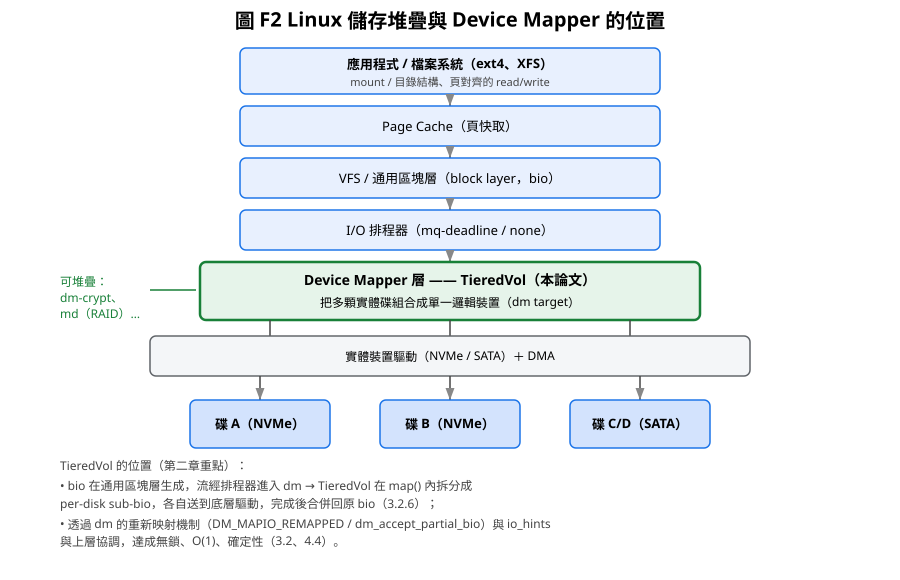

# 第二章 背景與相關研究

> **本章導讀**：2.1 建立 Linux 儲存堆疊與 dm 的技術背景；2.2 比較既有 dm target；
> 2.3 分類異質/分層儲存方案；2.4 回顧性能模型與動態平衡相關研究；2.5 定位本論文；
> 2.6 列出參考文獻。本章的任務是讓第三章的「選擇」都有據可依。

## 2.1 Linux 儲存堆疊

### 2.1.1 I/O 路徑全景

Linux 的 I/O 路徑由上而下為：

```
應用程式（read/write）
  └─ VFS（虛擬檔案系統，inode/dentry 快取）
      └─ 檔案系統（ext4 / xfs / btrfs …）→ 依檔案邏輯區塊映射後，發出 struct bio
          └─ 通用 block layer（block_device、bio、request_queue、bio set）
              └─ I/O 排程器（mq-deadline、bfq、none——多佇列下多為 none）
                  └─ 裝置驅動（nvme / ahci / virtio_blk …）
                      └─ 實體裝置
```

檔案系統負責「檔案 → 邏輯區塊」的轉譯；**區塊層（block layer）**負責把邏輯區塊
`bio` 排入 `request_queue`；裝置驅動最終把它送到硬體。在這條路徑的中間，
存在一個可堆疊的軟體層——**Device Mapper（dm）**——讓使用者把「邏輯裝置」疊在
「一個或多個實體（或虛擬）裝置」之上，對上層呈現單一區塊裝置。



> **圖 F2 說明**：TieredVol 位於通用區塊層之下的 dm 層，把上層 bio 依權重拆成
> per-disk sub-bio 送到底層驅動（3.2.6）；dm 的重新映射與 io_hints 機制是
> 達成無鎖、O(1)、確定性的介面前提（3.2.5、4.4）。

### 2.1.2 bio 模型

上層以 `struct bio` 攜帶一次 I/O 的資訊：起始邏輯扇區（`bi_iter.bi_sector`）、
方向（`bio_data_dir()`：READ/WRITE）、長度（`bi_iter.bi_size`，單位位元組）、
以及頁面區段（segments）。dm target 的 `map()` 收到 bio 後有兩類選擇：

1. **改寫並轉發**：修改 `bi_bdev`（目標裝置）與 `bi_sector`（偏移），回
   `DM_MAPIO_REMAPPED`，由 dm core 提交；
2. **自行處理**：clone 成多個 sub-bio 平行提交、緩衝、或直接完成，回
   `DM_MAPIO_SUBMITTED`。

條帶化 target 的典型需求是「一個 bio 跨到多顆碟」：可自行拆（平行寫路徑），
或用 `dm_accept_partial_bio()` 把「塞得進目前碟區的部分」交還 dm core，由 dm
對剩餘部分重新呼叫 `map()`（跨碟拆分主要由 dm 承擔）。

### 2.1.3 dm target 的生命週期與回呼

一個 dm target 實作以下核心回呼（`struct target_type`）：

| 回呼 | 時機 | 職責 |
|------|------|------|
| `ctr()` | `dmsetup create` | 解析參數、初始化資料結構、設定 `io_hints` 與 `max_io_len` |
| `map()` | 每筆 bio 到達 | 決定轉發到哪碟哪偏移（熱路徑，需最快） |
| `end_io()` | bio 完成 | 統計、錯誤處理、DEGRADED 標記 |
| `status()` | `dmsetup status` | 輸出權重、計數器、狀態 |
| `message()` | `dmsetup message` | 執行期命令（切 policy、觸發 rebuild、查 mirror） |
| `dtr()` | `dmsetup remove` | 釋放資源、持久化狀態 |

此外 `ctr()` 可用 `dm_set_target_max_io_len()` 限制進入 `map()` 的 bio 上限
（條帶化 target 設為一個條帶長），並透過 `io_hints` 告知上層建議的
`chunk_sectors`、`io_min`、`io_opt`，讓檔案系統以對齊的方式發送大塊 I/O。

## 2.2 Device Mapper 既有 target

dm 生態中與本論文直接相關的 target 比較：

| target | 行為 | 異質碟問題 |
|--------|------|-----------|
| `linear` | 多碟線性拼接成連續大容量 | 不分散 I/O；單一 bio 只落在單碟，其他碟可能閒置 |
| `striped` | 等權條帶：固定 chunk 依序輪流分配到各碟 | **假設各碟等速**；異質碟下最慢碟為瓶頸，快碟被拖累 |
| `mirror` | 同步鏡像（RAID1）：寫入複寫、讀取任選 | 追求可靠；無權重、無性能感知 |
| `raid` | 多 RAID 層級（0/1/5/6/10） | 條帶化部分同 `striped`，等權假設 |
| `cache` | SSD 快碟 + HDD 慢碟兩層快取 | 僅快/慢兩層；無多碟權重分配；依賴命中率 |
| `snapshot`/`thin` | 快照、精簡配置 | 資料保護/配置，非性能分配 |

**核心觀察**：`striped`（與硬體 RAID0 同源）是異質碟問題最直接相關的 target，
但它把權重固定為 `1:1:…:1`。本論文 TieredVol 即 `striped` 的推廣——允許
**每碟不同的權重**，使分配比例匹配各碟實際性能，同時保留條帶化的並行優點，
並在此基礎上加入鏡像與容錯（`mirror`/`raid` 的能力）與動態平衡（新機制）。

## 2.3 異質與分層儲存方案

### 2.3.1 硬體層

- **硬體 RAID 控制器**：RAID 0（條帶）與 RAID 5/6/10 皆以等權條帶為基礎，
  假設磁碟陣列同型等速；控制器價格高，且對「混用異質碟」缺乏權重感知。
- **企業儲存（SAN/NAS）**：如 NetApp FlexVol/Tiered Storage、Dell Storage Spaces
  （Storage Spaces 提供 mirror/parity，部分版本有 tiering），多為閉源、企業級，
  缺乏開放內核實作與學術可重現性。
- **階層儲存的學術典範——AutoRAID**：HP 的 AutoRAID（[11]）在磁碟陣列內自動把
  資料分層於「快碟層（鏡像）與慢碟層（RAID5）」之間，是本論文「兩層快取家族」
  的學術源頭：本質是**熱資料置放**，而非多碟權重並行。

### 2.3.2 軟體層

- **Linux MD（mdraid）**：與 dm `striped` 同理，條帶等權；RAID5/6 以等權分攤。
- **dm-cache**：以 SSD 為快碟、HDD 為慢碟，快取命中率決定成效；本質是
  「熱資料置放」，不是「並行分配」。
- **bcache**：功能等同 dm-cache 的獨立實作（作者 Kent Overstreet）；同樣為兩層快取，
  不處理多碟並行權重。
- **flashcache / Intel CAS**：工業界在 block 層以 SSD 當快取的實作
  （Facebook flashcache、Intel Cache Acceleration Software），同屬兩層快取家族；
  flashcache 本身即是 dm target，可視為「在 dm 內做 SSD 快取」的先例。
- **ZFS（OpenZFS）**：以 vdev 條帶化（RAIDZ/鏡像）組合磁碟；L2ARC 以 SSD 做讀快取。
  ZFS 對異質 vdev 一樣沒有權重感知，分層依賴快取命中與分配策略，非純吞吐最優化。
- **LVM 快取 / 內核 zram**：LVM 有 cache 工具（fast slow 兩層）；zram 以記憶體壓縮
  當快取——都屬兩層快取家族。

### 2.3.3 分類小結

既有方案可歸兩大類：

| 類別 | 代表 | 目標 | 異質碟處理 |
|------|------|------|-----------|
| 條帶化（並行吞吐） | RAID0、dm-striped、MD、ZFS vdev | 讓多碟並行、吞吐加乘 | **等權假設，異質下失真** |
| 分層快取（熱資料置放） | dm-cache、bcache、ZFS L2ARC、LVM cache | 把熱資料放快碟 | 僅快/慢兩層，依賴命中率 |

TieredVol 屬第一類的**權重化推廣**：不在「快/慢」間搬移資料，而是讓**每一筆寫入都
依權重並行分布到全部碟**，從根本避免慢碟獨扛整串寫入。對「性能差異很大」的情境，
權重化條帶比「等權條帶」或「兩層快取」更直接地利用全部碟的聚合頻寬。

## 2.4 相關性能模型與研究

### 2.4.1 瓶頸碟模型

異質碟並行寫入的吞吐上界，可用「瓶頸碟」模型描述：權重向量 W、總權重 ΣW、
各碟順序寫入速率 soloᵢ，理論總吞吐 T 受**最先被灌飽的碟**限制：

```
T(W) = min_i ( soloᵢ × ΣW / wᵢ )          … (2.1)
```

直覺：碟 i 分到總資料量的 wᵢ/ΣW；若總吞吐為 T，碟 i 承擔 T×wᵢ/ΣW，不得超過 soloᵢ，
故 `T ≤ soloᵢ×ΣW/wᵢ` 對所有 i 成立，瓶頸即此值最小者。當權重與 solo 成正比
（wᵢ ∝ soloᵢ）時各項相等、`T = Σsoloᵢ`，達理論上限。第三章 3.3 給出證明。

本模型與經典「系統瓶頸/資源排隊」觀點一致：多資源並行系統的總吞吐受最緊資源限制
（類似 `min-plus` 聚合；也與 Gray & Shenoy 提出的「吞吐受最慢資源限制」經驗法則
一致 [13]）。RAID 條帶化之吞吐上限討論可追溯至 RAID 奠基論文 [12] 對條帶化
「並行吞吐」的原始動機。本論文的貢獻在於把它落到**可量測的異質碟權重分配**，
並補上兩個實務干擾項的修正：

1. **共享匯流排（DMI）**：走南橋的碟共用上行頻寬，各碟「自覺瓶頸」成立但
   「共享資源瓶頸」更早出現 → DMI-aware 權重（3.3.3）。
2. **SLC 快取暫態**：NVMe 短寫落在 SLC 帶狀，solo 量測與短寫結果隨快取狀態漂移 →
   排水態量測協定（6.1.2）。

### 2.4.2 條帶化與動態平衡相關研究

- **等權條帶**（RAID0 家族）在異質碟下的退化已有大量工業共識，但多數以「換掉慢碟」
  或「分組」解決，鮮有開放權重化 target。
- **動態選碟**（依負載/EMA 即時選最閒碟）直覺上能最佳化，但會破壞位址確定性：
  同一邏輯位址在不同時間落不同碟，快取/快照/重啟後的位址一致性難以維持。
  本論文曾實作 EMA 三因子 adaptive policy 並實測失衡（-44%），證實此路徑不可行，
  轉而採用「**靜態佈局 + 例外借調**」（4.1）：正常路徑保持確定性，僅對慢碟
  高負載的整塊寫入做受控 offload，兼得確定性與動態平衡。

## 2.5 本論文定位

| 面向 | 既有方案 | TieredVol |
|------|----------|-----------|
| 分配單位 | 等權 chunk | **權重化 chunk** |
| 映射 | 除法/查表 | **O(1) 無表數學映射（確定性）** |
| 性能感知 | 無 | **瓶頸模型 (2.1) + auto_weight** |
| 共享匯流排 | 未處理 | **DMI-aware 權重** |
| 動態平衡 | 無（或動態選碟破壞確定性） | **weight borrowing（靜態佈局上的例外）** |
| 容錯 | 另開 target（mirror/raid） | **內建 mirror/rebuild/badmap** |
| 驗證 | 基準測試 | **四層測試架構** |

本論文填補「權重化、性能感知、可容錯」的異質碟條帶 dm target 空缺，
並以真實異質平台（B85 + 4 碟）的完整量測驗證模型與實作。

## 本章小結

第二章完成了背景鋪陳：Linux 儲存堆疊與 Device Mapper 框架（2.1–2.2）、既有
條帶/分層/鏡像 target 的比較（2.3）、相關性能模型與量測文獻（2.4）、本論文定位
（2.5）。第三章到第五章將依序提出設計與實作，第六章以本平台量測回應
2.4 的模型宣稱。

## 2.6 參考文獻

[1] The Linux Kernel Documentation — Device Mapper (online documentation).
    https://www.kernel.org/doc/html/latest/admin-guide/device-mapper/index.html
[2] The Linux Kernel Documentation — dm-striped (online documentation).
    https://www.kernel.org/doc/html/latest/admin-guide/device-mapper/striped.html
[3] The Linux Kernel Documentation — dm-linear (online documentation).
    https://www.kernel.org/doc/html/latest/admin-guide/device-mapper/linear.html
[4] The Linux Kernel Documentation — dm-cache (online documentation).
    https://www.kernel.org/doc/html/latest/admin-guide/device-mapper/cache.html
[5] The Linux Kernel Documentation — dm-raid：MD RAID over DM (online documentation).
    https://www.kernel.org/doc/html/latest/admin-guide/device-mapper/raid.html
[6] The Linux Kernel — block layer 與 bio 核心原始碼：`block/bio.c`、
    `include/linux/bio.h`、`include/linux/blk_types.h`（v5.x 內核原始碼）。
[7] Overstreet, K. — bcache：A Linux block-layer cache (project documentation).
    https://bcache.evilpiepirate.org/
[8] OpenZFS — vdev、RAIDZ 與 L2ARC 文件 (project documentation).
    https://openzfs.org/wiki/Main_Page
[9] LVM2 — Linux Logical Volume Manager (project documentation).
    https://sourceware.org/lvm2/
[10] Axboe, J. — Efficient I/O with io_uring（原廠技術白皮書）.
     https://kernel.dk/io_uring.pdf
[11] Wilkes, J., Golding, R., Staelin, C., Sullivan, T. — The HP AutoRAID
     Hierarchical Storage System. ACM Transactions on Computer Systems (TOCS),
     14(1):108–136, 1996.
[12] Patterson, D., Gibson, G., Katz, R. — A Case for Redundant Arrays of
     Inexpensive Disks (RAID). In Proc. ACM SIGMOD, pp. 109–116, 1988.
[13] Gray, J., Shenoy, P. — Rules of Thumb in Data Engineering.
     Microsoft Research Technical Report MSR-TR-99-100, 2000.
[14] Bohan, M. (Facebook) — flashcache：A general purpose writeback block cache
     for Linux. https://github.com/facebookarchive/flashcache

> 註：本論文為中文稿，正文以 [n] 對應本節編號引用；定稿時依學校格式排版
> （作者、年份、出處、DOI/URL），並補正式引用連結。
