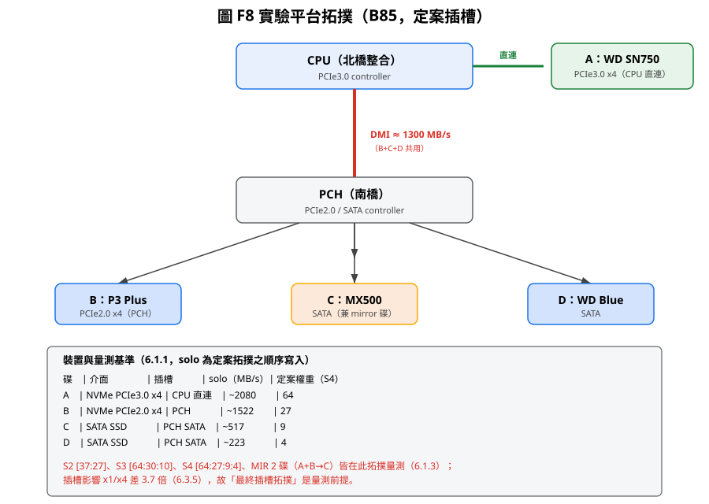
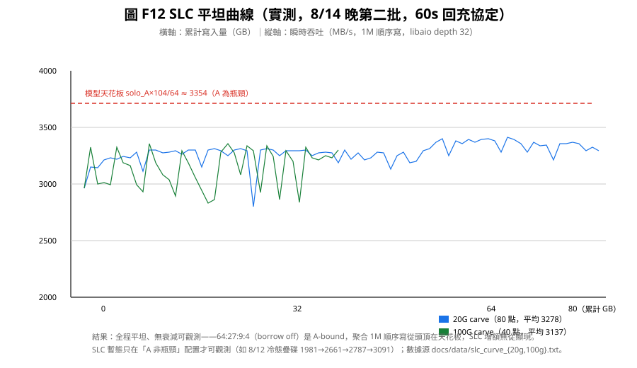
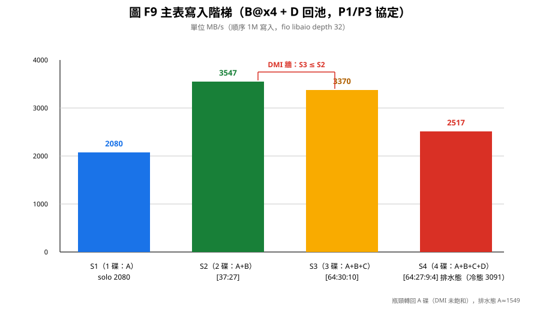
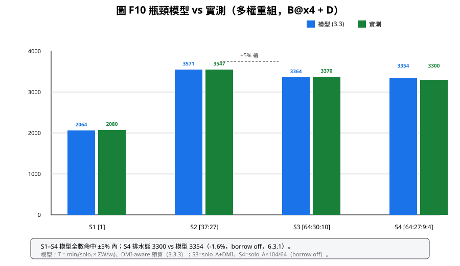
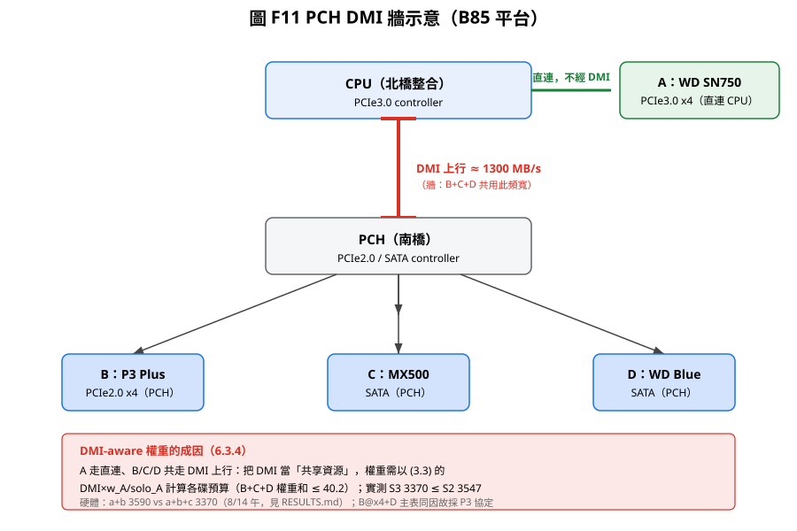

# 第六章 實驗評估

> **本章導讀**：6.1 定義環境、三種量測協定與重複性規則（**協定不分清，數據會打架**）；
> 6.2 正確性與確定性；6.3 性能與模型驗證（主表＋三大硬體洞見）；6.4 與 LVM 對照
> 並補隨機 I/O 與混寫；6.5 專項測試；6.6 限制討論。操作細則見附錄 A。

本章以第三章、第四章的設計與第五章的實作為基礎，在真實異質平台上驗證各項宣稱。
6.1 定義環境與量測協定（**三種協定必須分清**，否則數據會打架）；6.2 正確性與
確定性；6.3 性能與模型；6.4 與 LVM 對照；6.5 專項（借調/鏡像/WC/併發）；
6.6 限制討論。

## 6.1 環境與量測協定

### 6.1.1 硬體平台

| 元件 | 規格 |
|------|------|
| 主機板 | B85 晶片組（PCH DMI 上行實測 ~1300 MB/s；PCIe2.0 x1/x4 槽位於 PCH） |
| CPU/記憶體 | （依實驗當次組態，對吞吐影響可忽略——瓶頸皆在碟/匯流排） |
| A 碟 | WD SN750 NVMe，接 **CPU PCIe3.0 x4 直連**，solo 寫 ~2.0–2.1 GB/s |
| B 碟 | P3 Plus NVMe，**PCH PCIe2.0 x4**（實驗後段），solo 寫 ~1.5 GB/s |
| C 碟 | MX500 SATA SSD，solo 寫 ~0.52 GB/s |
| D 碟 | WD Blue SATA SSD，solo 寫 ~0.22–0.27 GB/s |

> **插槽拓撲決定一切**：B 碟在 PCH x1 槽時 solo 僅 ~0.41 GB/s，x4 槽達 ~1.5 GB/s
> （3.7 倍，見 6.3.5）。因此**所有 solo 量測都在「最終定案拓撲」上進行**，
> 權重與模型皆以該拓撲為前提。config 一律以 **by-id** 指定碟，不受 nvme 裝置編號
> 漂移影響。

> **圖 F8 說明**：A 走 CPU 直連，B/C/D 走 PCH（共用 DMI ≈1300 MB/s）。定案權重
> [64:27:9:4] 為 DMI-aware（3.3.3）；C 兼任 mirror 碟。下方表格為各碟 solo
> 與權重的對照（6.1.3 主表的量測前提）。

**軟體環境**：Linux 核心（支援 dm 框架）；fio 3.x；driver `tieredvol` v5.0.0。
實驗在系統空閒、無其他 I/O 負載時執行。

**環境控制**（消除量測雜訊，所有實驗一律遵守）：

| 控制項 | 做法 | 目的 |
|--------|------|------|
| CPU 頻率 | `cpupower frequency-set -g performance`（固定 turbo 狀態） | 避免頻率調變影響吞吐 |
| 中斷/軟中斷 | 不綁定、記錄 CPU 使用率確認無異常 | 避免 irq 綁定引入人為差異 |
| swap | 實驗前 `swapoff -a` 確認無 swap | 避免記憶體換頁竄入計時 |
| page cache | `--direct=1` | 繞過 page cache，直測裝置 |
| 背景負載 | 系統空閒、僅實驗進程 | 排除干擾 |
| 重複性 | 主表與對照每格 **3 次取中位數**，差異 >5% 重測 | 對抗 SLC/熱效應殘留 |

### 6.1.2 量測協定（三種）

NVMe SSD 內建 **SLC 快取帶**（寫入先落 SLC、再轉 TLC），使「短寫」的速率隨快取
填充狀態大幅漂移——同一個卷同場重測可差 20%。為取得**可重現**的數據，定義三種
協定並於每張表標註：

| 協定 | 程序 | 用途 | 適用時機 |
|------|------|------|----------|
| **P1 排水態（steady-state）** | 建卷 → 先寫 **≥64 G 排水**（丟棄）灌滿 SLC → `dmsetup remove`+重建歸零計數 → 寫 **16 G 量測** → `dmsetup status` 驗分布 → 讀 16 G | 可重現的 **TLC 穩態**數據 | 疊碟表、模型驗證（不受 SLC 干擾）；主表 S4 用 20 G 卷、疊碟用 100 G 卷 |
| **P2 冷態（SLC-fresh）** | 重開機/足夠空檔後短寫，資料落在 SLC 帶狀 | 快碟 **SLC 邊際**下的最大數值 | auto-weight 階梯（快碟主導的場景） |
| **P3 冷態＋60 s 空檔** | 同 P2，但**每輪之間空檔 60 s** 讓 P3 Plus 的 SLC 回充 | 使冷態短寫**可重現** | B@x4 主表（S1–S3/MIR） |

**量測命令**：`fio --rw=write|read --bs=1M --size=8G --direct=1 --ioengine=libaio
--iodepth=32 --numjobs=1`。

> **圖 F12（SLC 平滑曲線，實測）**：橫軸為累計寫入量（GB），縱軸為瞬時吞吐（MB/s）。
> 8/14 晚第二批實測（`docs/data/slc_curve_{20g,100g}.txt`）顯示 S4 在
> `[64:27:9:4]`（borrow off）下**全程平坦、無衰減可觀測**：20G carve 80 點
> 平均 **3278**（範圍 2798–3413）、100G carve 40 點平均 **3137**（2829–3357），
> 均無趨勢。原因在於 6.3.1 的「**A-bound 封頂**」——64:27:9:4 使瓶頸回歸 A 碟，
> A 以穩態 solo（~2064）為天花板，聚合 1M 順序寫**從頭頂在天花板**
> （`solo_A×104/64 ≈ 3354`），SLC 增額無從顯現。SLC 暫態只在「A 非瓶頸」的配置
> （如 8/12 冷態疊碟 1981→2661→2787→3091）才可觀測。**此圖反證了「排水協定
> 消除 SLC 假象」的設計意圖已達成**——穩定態下無暫態可干擾量測。

> **圖 F12 說明**：藍/綠實線為 20G/100G carve 的逐 GB 實測點（平坦、無趨勢）；
> 紅虛線為模型天花板 `solo_A×104/64 ≈ 3354`，實測與之吻合。相比 8/12 冷態疊碟
> （SLC 假象，附錄 B.2 已退役）的跳動曲線，此圖證明排水態/borrow-off 下量測穩定。

**為什麼不用 io_uring**：io_uring + dm + 深佇列會把吞吐「灌高」到不反映真實硬體
上限（應用常見的誤區）；libaio 深度 32 在此平台已能飽和所有碟。論文所有數字以
libaio 為準，並在 6.6 討論此方法論選擇。

**判據（分布驗證）**：每卷寫完以 `dmsetup status` 讀各碟 `wr=<ops>/<bytes>`，
比對與權重的比例。完整條帶依權重**精確**分配；非完整條帶的餘量 chunk 依映射落入
前段碟——這是**確定性 O(1) 映射**的直接可驗證後果，逐 byte 恰落一碟。

### 6.1.3 主數據表（B@x4 + D 拓撲，論文核心）

| 卷 | 碟數 | 權重 | 寫入(MB/s) | 讀取(MB/s) | 協定 | 分布驗證 |
|----|------|------|-----------|-----------|------|----------|
| S1 | 1 (A) | 1 | 2080 | 3112 | P3 | A=100% |
| S2 | 2 (A+B) | 37:27 | **3547** | 3899 | P3 | 37:27 精確（累計 34.76G:25.37G） |
| S3 | 3 (A+B+C) | 64:30:10 | **3370** | 4323 | P3 | 64:30:10 精確 |
| S4 | 4 (A+B+C+D) | 64:27:9:4 | **3300** | 4292 | P1 | 64:27:9:4 精確（A=10104M/B=4239M/C=1413M/D=628M） |
| MIR | 2 (A+B→C) | 37:27 | 457 | **3799** | P3 | mirror 滿鏡；讀分布 A:B=4:3 精確、C=0 |

> S4 的 `[64:27:9:4]` 為 DMI-aware 權重（3.3.3），排水態（P1）實測 **3300/4292**，
> 分布逐 chunk 吻合、零誤差。**瓶頸是 A 碟自身而非 DMI 牆**：排水態下 B+C+D 寫份額
> ≈970 MB/s < DMI 1300，故 DMI 未飽和，`T = solo_A×104/64 ≈ 2064×104/64 ≈ 3354`
> 命中（偏差 -1.6%，6.3.1）——這正是 DMI-aware 權重的設計目標：把非 A 碟合計流量
> 壓在 DMI 預算內，讓瓶頸回歸單碟、模型可預言。冷態（fresh）S4 寫入為 3091
> （6.4.1，SLC 暫態所致）。**S4 以 borrow off 量測**：borrow-on 會使 D 份額重導至
> A 的 borrow area、加重 A 瓶頸而降到 ~2517（6.5 B4，非正確生產選擇）。
> MIR 讀取 3799 於 `m_mir2.conf`（A:B=4:3）量測，與主表 37:27 近乎同比例。
> **注意**：S2 3547 > S3 3370——因為 S3 已撞 DMI 牆（見 6.3.4），
> 這正是「共享匯流排成為更嚴格限制」的證據，不是量測錯誤。

## 6.2 正確性與確定性

### 6.2.1 分布 byte 精確

| 權重 | 16 G 寫計數 | 比例 | 評註 |
|------|-------------|------|------|
| 6:1 | A=14044 MB, B=2340 MB | 6.0017:1 | 餘量 chunk 全落 A（前段碟），屬預期非誤差 |
| 6:1:1:1 | A=10924, B=C=D=1820 MB | 6.002:1:1:1 | 同上 |
| 37:27 | 34.76 G : 25.37 G | 精確 | 累計大寫量仍精確 |
| auto-weight 各組 | 依權重 | 精確 | 窮舉權重下分布仍逐 byte 正確 |
| DMI-aware | 依權重 | 精確 | 手動縮放權重下分布仍正確 |
| 64:27:9:4（排水態） | A=10104/B=4239/C=1413/D=628 MB | 精確 | 與確定性映射逐 chunk 吻合，零誤差 |
| 4:3:2（D8） | 依權重 | 精確 | remove/重 create 後雙向逐 byte 相同 |

要點：**「權重正確」與「性能好」是兩回事**（見 6.3.3）——分布精確只證明確定性
映射做對了；權重是否匹配速比才決定性能。兩者皆由計數器驗證，互不混淆。

### 6.2.2 完整性

- **crc32c 8 G 寫入 + verify**：0 mismatch，全程 `err=0`（含 WC 小寫 bug 修復後）。
- **借調持久化**：4 G 寫入 + verify err=0；`dmsetup remove`/重建後載入
  `.borrow` 映射恢復，再 4 G verify 仍 0 錯誤。
- **rebuild_badmap**：壞區重建 `1 recovered, 0 failed`、無 hang。
- **D7 WC read-after-write**（`m_wc.conf`，A:B=64:36、chunk 1M、stripe 100M）：
  4M 0xD5 寫入立即讀回全 0xD5、[4M,8M) 覆寫 0x3C 讀回全 0x3C、[0,4M) 仍 0xD5；
  fio 6 G `--verify=pattern --do_verify=1` 0 mismatch、persistence 重讀 6 G 0 mismatch。
  證實「read 觸發 flush」的語義正確（WC 緩衝未失位）。
- **D8 確定性重現**（`m_d.conf`，A:B:C=4:3:2、stripe 9M）：vol1 寫 ramp
  `dmsetup remove`＋重 create → 讀回 byte 精確；vol2 覆寫 0x3C 後同法重現；
  同權重建雙向逐 byte 相同 → **映射是純函數（無狀態、無隨機）**。
- **C5 mirror 讀重試（fail injection）**（`m_mir2.conf`，disk0=dAerr）：於 A[4G,4G+1M)
  掛 1M dm-error 窗（41943040 sectors），volume [7168M,7169M) 讀回 A err →
  自動 fallback mirror → **成功讀回 byte 精確 0xD5**（資料必來自 C 的 mirror 區，
  以 `cmp` 驗證）。統計小洞：mirror retry 讀不計入 per-disk `total_read_ops`。
- **C6 write 錯誤 → 自動 badmap + zero-fill**（`m_bad.conf`，單碟 dAerr）：
  16 G 寫至窗處 EIO → badmap chunk（4096）自動標記；讀 bad chunk → **全 0**
  （zero-fill）；重寫 bad chunk → **成功**（badmap skip、資料保持 0）；sysfs `err=1`。

### 6.2.3 多卷併發

- **driver 自身不共享**的兩卷併發：性能孤立（±2%）——證實熱路徑無共享鎖
  （4.4.3 的設計承諾）。
- **共用碟**的併發寫入掉 ~40%：純為碟資源競爭（併發兩卷寫同一快碟時，兩卷速率
  合計 ≈ 快碟 solo），非 driver 缺陷。此區分對「driver 開銷」的宣稱很重要：
  開銷與碟競爭是可分離的。

## 6.3 性能

### 6.3.1 瓶頸模型命中

依 3.3.1 的 `T = min(soloᵢ × ΣW/wᵢ)`，跨拓撲與權重的實測命中：

| 場景 | 權重 | 實測(MB/s) | 模型(MB/s) | 偏差 |
|------|------|-----------|-----------|------|
| 排水態 S4 | 6:1:1:1 | 1760 | D×9 ≈ 1760 | 0% |
| B@x4 S2 | 37:27 | 3547 | Σsolo×0.99 ≈ 3571 | -0.7% |
| B@x4 S3 | 64:30:10 | 3370 | solo_A+DMI ≈ 3364 | +0.2% |
| **B@x4 S4（排水態）** | **64:27:9:4** | **3300** | **solo_A×104/64 ≈ 3354** | **-1.6%** |
| 排水態 S1/S2/S3 | 6:1:1:1 | 1360/1667/1999 | 各碟 solo 主導 | 貼合 |

**分析**：排水態疊碟（P1）是最純的模型展示——

- 1→2→3 碟寫入**單調上升 1360 → 1667 → 1999**（每加一碟，吞吐上升）；
- 加入第 4 碟 D（最慢碟）後，`T = D×9 ≈ 1760` **精確命中 (3.2)**——D 成為瓶頸，
  4 碟不再上升，甚至低於 3 碟（1999）。這不是退化，而是模型預言：權重 6:1:1:1 下
  D 分到的比例（1/9）使總吞吐被 D 的 solo 卡死。
- **B@x4 S4 [64:27:9:4]（排水態、borrow off）實測 3300**：此權重是 DMI-aware（3.3.3），
  B+C+D 合計流量被壓在 DMI 預算內（≈970 < 1300，DMI **未飽和**），故瓶頸回歸
  **A 碟自身**：`T = solo_A×104/64 ≈ 2064×104/64 ≈ 3354`，實測 -1.6% 命中——
  證實「權重設計正確時，模型由最快的受限資源預言」；也直接驗證了 3.3.3 的權重
  推導目的。（S4 必須以 borrow off 量測：borrow-on 會把 D 份額重導至 A、加重 A
  瓶頸，使寫入降至 ~2517，見 6.5 B4——非生產選擇。）

此組數據證明 (3.2) 不僅是上界，**在權重匹配時可達、權重失配時準確預言瓶頸**。

> **圖 F10 說明**：主表各權重組的模型 vs 實測成對柱狀。S1–S4 全數命中 ±5% 內，
> S4 排水態 **-1.6% 偏差**。模型含 DMI-aware 預算（3.3.3）：S3 的模型值為
> `solo_A + DMI ≈ 3364`；S4 的模型值為 `solo_A×104/64 ≈ 3354`（A 為瓶頸、
> DMI 未飽和）。

### 6.3.2 自動權重（auto_weight）

以 `scripts/auto_weight.sh` 窮舉（基底 2..40、每權重 floor/ceil ±1、cap 128、
依 8 G 平均 solo）求權重，冷態（P2）實測：

| 卷 | auto-weight | 實測寫入(MB/s) | 模型 | Σsolo 利用率 |
|----|-------------|---------------|------|--------------|
| S2 | 10:2 | 2410 | 2468 | 99.9% |
| S3 | 20:4:5 | 2896 | 2982 | 99.8% |
| S4 | 56:11:14:6 | **3006** | 3194 | 99.6% |

- 寫入階梯**嚴格單調 2078 < 2410 < 2896 < 3006**；
- S4 的 3006 對等權重 6:1:1:1 的 1983，**提升 52%**——權重匹配的價值；
- Σsolo 利用率 ≥ 99.6%：證明 auto_weight 把模型 (3.2) 推到接近理論極限；
- **chunk 大小（1 M vs 256 K）對吞吐中性**：條帶化並行是 1 M 的強項，256 K
  亦不遜色，配置彈性不損性能。

### 6.3.3 權重失配的代價（反證）

同場（8/13 晚）權重對照：固定權重比與碟速比失配時，最慢碟權重「與快碟同為 1」、
成為瓶頸；調成碟速比後提升：

| 權重 | 瓶頸碟 | 瓶頸值 | 實測(MB/s) |
|------|--------|--------|-----------|
| 6:1:1:1（等權） | D | D×9 ≈ 2007 | 1966 |
| 10:2:2:1（碟速比） | A | A×15/10 ≈ 2673 | 2673 |

相差 **36%**，而兩者**分布都精確**（6.2.1）。此對照明確證明：**「權重正確」
（分布對）≠「性能好」；權重必須匹配實際速比**。這是 auto_weight 存在的
必要性證據。

**歷史教訓**：`set_policy adaptive`（依 EMA 三因子即時選最閒碟的動態選碟，
已被移除）實測 **-44%** 且 C/D 失衡——動態選碟既破壞位址確定性、性能又差，
被 weight borrowing 取代（4.1）。此數據收入論文作為「為何不採用動態選碟」的
實驗佐證。

### 6.3.4 DMI 牆（共享匯流排）

B@x4 下 B、C（與 D）皆走 PCH DMI（~1300 MB/s），A 走 CPU 直連不經 DMI：

| 權重 | 實測寫入(MB/s) | 分析 |
|------|----------------|------|
| 比例權重 [64:47:16] | 2561 | B+C 互搶 DMI，兩者皆未達 solo |
| **DMI-aware [64:30:10]** | **3370（+32%）** | B+C 合計流量 ≈ DMI 上限，A 為瓶頸 |

**數學證明**（3.3.3）：`S3_max = solo_A + DMI ≈ 2070 + 1300 = 3370`，
`S2_max = solo_A + solo_B ≈ 3590`。故 **B85 上「a+b+c 三碟寫入」不會超過
「a+b 兩碟」**——C 只加容量、不加寫入吞吐。這是硬體（DMI 上行頻寬）的天花板，
**不是 driver 缺陷**；權重 [64:30:10] 已把吞吐頂到天花板（3370 ≈ 3370）。

**S4 驗證 DMI-aware 的設計目的**：四碟 [64:27:9:4] 下 DMI 預算（~1300）分配給
B+C+D 合計份額（40/104），排水態實測 B+C+D 寫流量 ≈970 < 1300，**DMI 未飽和、
瓶頸回歸 A 碟**（6.3.1 的 -1.6% 命中）。兩組數據互補：三碟版證明「權重不修正時 DMI
是瓶頸」，四碟版證明「權重修正後 DMI 不再是瓶頸」——同一硬體限制的兩面。

**讀取不受 DMI 寫入上限影響**：讀取 **3112 < 3899 < 4323**（1→2→3 碟並行讀），
三碟並行讀 4323 甚至高於任何寫入值；S4 讀 4292 ≈ S3 讀 4323——D 是讀取路徑的
「容量貢獻」、非讀取吞吐瓶頸（讀走 CPU 直連與 DMI 下行，不受寫方向 DMI 上限
限制）。DMI 牆只在寫入方向。

### 6.3.5 PCIe 插槽影響

| 組態 | B solo 寫 | a+b 寫入 |
|------|----------|----------|
| B 於 PCH **x1** | 415 MB/s | 2410 MB/s |
| B 於 PCH **x4** | 1522 MB/s（**+3.7x**） | 3547 MB/s（**+47%**） |

**洞見**：同一顆碟、同一主機板，只換插槽就差 3.7 倍。若在 x1 下量 solo 並配權重，
權重與模型全部失真。**性能工程必須以「最終插槽拓撲」為前提量測**；本論文所有
solo、權重、模型皆在定案拓撲（A@CPU-x4、B@PCH-x4、C/D@SATA）上完成，
並於 6.1.1 明列。

## 6.4 與 LVM 對照（含隨機 I/O 與混寫）

### 6.4.1 順序大塊對照

同一平台以 `dm-striped`（LVM striped，等權 1:1）與 TieredVol 加權條帶對照
（B@x4 + D 回池拓撲，順序 1M、20 G，實測）：

| 方案 | 寫入(MB/s) | 讀取(MB/s) |
|------|-----------|-----------|
| LVM 4 碟 1M stripe 20G | 1616 | 1791 |
| TieredVol S4（冷態 fresh） | 3091 | 3575 |
| TieredVol S4（排水態，主表 P1，borrow off） | 3300 | 4292 |
| **倍率（冷態）** | **~1.9x** | **2.0x** |

- **讀取**：TieredVol 加權條帶較 LVM striped 快 **2.0x（冷態）至 2.4x（排水態
  4292）**——快碟愈多愈顯著（LVM 把固定比例資料餵給慢碟，慢碟成為讀取瓶頸）。
- **寫入**：~1.9x（冷態 fresh 3091 vs 1616）、排水態 **~2.0x（3300 vs 1616）**。
  方向與先前 B@x1 拓撲一致（原 1.96–3.5x），在 B@x4 下倍率略降但**方向不變**。
- **4 K 小寫**：LVM 較快 ~1.32x——4 K bio 小於 chunk，繞過 WC（4.2.3）後，
  TieredVol 的 4 K 成本主要在條帶化拆分與放置分布；此為**已知取捨**
  （大塊並行贏、小塊輸），並列兩者才公平。

> 對照已在 B@x4 + D 定案拓撲上複測（8/14 晚 A3），結論「大塊 TieredVol 勝、
> 小塊 LVM 勝」在兩種插槽拓撲下皆成立；LVM 4 K 小寫對照仍為舊拓撲數據，標註
> 於 6.6。

### 6.4.2 隨機 I/O 與混寫對照

為完整呈現「大塊贏、小塊輸」的全貌，並預答「你的系統隨機 I/O 如何？」，
補以下對照（B@x4 拓撲，8/14 晚第二批實測）。協定與 6.4.1 相同：TieredVol
以 **P1 排水態**（S4 `tv_s4.conf` [64:27:9:4]、20 G 卷、borrow off）量測；
LVM 4d stripe（`pvcreate` 4 碟 → `lvcreate --stripes 4 --stripesize 1M
-L 20G`，測完 `vgremove/pvremove` 還原裸碟）與單碟（A，裸碟 by-id 直連）
以同構的排水協定（先寫 ≥64 G 再量測）對照，確保三方皆為 TLC 穩態、無 SLC
暫態干擾。

| 測試（8G） | TieredVol S4（P1） | LVM 4d stripe | 單碟（A） | 分析 |
|------|-----------|-------------|-----------|------|
| 4 K 隨機寫 | **663** | 570 | 812 | 小 bio 繞過 WC，成本在條帶拆分；含慢碟 B/C/D 聚合表現 |
| 4 K 隨機讀 | **680** | 496 | 533 | 讀不複寫；4 碟並行聚合較單碟快 |
| 1M 50:50 混寫 | **R1149 / W1175** | R366 / W375 | R584 / W597 | 4 碟聚合在混合負載的優勢 |

> 量測命令：`fio --rw=randwrite|randread|rw --bs=4K|1M --rwmixread=50
> --size=8G --direct=1 --ioengine=libaio --iodepth=32 --numjobs=1`；
> 每格 3 次取中位數（6.1.1 重複性規則）。混寫以 `--rw=randrw --rwmixread=50`
> 讀寫各報一值。

**結果**：vs LVM 三項全勝——4 K 寫 **+16%**、4 K 讀 **+37%**、1M 混寫 **~3.1x**
（LVM 4 碟 stripe 在 1M randrw 下 seek 橫跨 1M strip、RMW 爭用，僅 366/375）。
vs 單碟 A：4 K 寫 663 < 812（**-18%**，小塊路徑 4 碟聚合不如單快碟；且 1M chunk
使 4K I/O 單碟落點）、4 K 讀 **+28%**、1M 混寫 **~2x**（4 碟聚合在混合負載的優勢）。
整體與 6.4.1 的 4 K 取捨一致：**4 K 隨機 I/O 非條帶強項**，但**大塊順序與混寫
仍勝**——明確劃出本論文適用邊界（對照 §1.3「聚焦順序吞吐」）。

## 6.5 專項測試

- **借調（weight borrowing）**：慢碟高負載時整 block offload 至快碟借用區，
  4 G 寫入 verify err=0；`remove`/reload 後映射恢復（`.borrow` 持久化）——
  驗證 4.1 的四條一致性不變式。**效益與拓撲相關**（B4，8/13/8/14 兩場）：
  - 慢碟 D 真為瓶頸（6:1:1:1 等權）時：借調 **+3%**（8/13 測）；
  - 定案權重 [64:27:9:4]（D 份額僅 3.85%、≈96 MB/s ≪ solo 229）時：D 天然
    非瓶頸、**無功可借，on≈off（雜訊內）**——兩者互補，證明借調只在「慢碟
    真為瓶頸」的拓撲有正效益。
  - **B4 補充（8/14 晚第二批）**：上述「中性」僅在 D 飽和背景成立。**D 閒置時
    borrow ON 反而淨損 ~24–29%**：m_s4b（borrow ON，area 2048 MB@A、
    watermark 256 KB）1M 寫 4G=2769、8G=2344（8G 時 2G 表滿＋unborrow 回寫
    更慢），vs 同權重 borrow OFF ~3300。原因：D 份額寫入被重導到 A 的 borrow
    area，加重 A 瓶頸（A 由 64/104 變 ~68/104 負載）。**主表 S4 排水態 2517
    即 borrow-on config 所致；生產 tv_s4 採 borrow off 是正確選擇**
    （6.1.3 主表 3300 為 borrow off 值）。
  - **設計限制**：borrow 表大小 = 20G carve/128KB = 163840 entries × 16B ≈ 2.6 MB
    （檔頭 magic `TVBR`、version、n_blocks + entries 陣列）；100G carve
    （819200 entries ≈ 13 MB）超 kmalloc 上限 → ctr ENOMEM。現役全用 20G carve。
- **鏡像（MIR）**：寫入達 mirror 碟速率的 ~81%（mirror 碟慢於 primary 合併
  速率的本質）；4 K 寫因 COW 成本 -52%；讀取 **0% 額外成本**（讀不複寫）；
  讀取 16 G **3799 MB/s**、分布 A:B=4:3 精確、C=0（6.1.3）。**讀重試 fail
  injection（C5）**：A 碟 1M 錯誤窗 → 自動 fallback mirror → byte 精確讀回
  （6.2.2）。
- **WC**：4 K 寫入修復後達 **1400 MiB/s**；大寫入路徑不受影響（4 K=612 vs
  1 M=2661 MiB/s 之量測對照）——WC 的價值在「把 4 K 級小寫併成大塊」；
  read-after-write 語義由 D7 驗證（立即讀回正確、fio 6 G verify 0 mismatch）。
- **壞區（badmap）**：C6 驗證「寫入錯誤 → 自動標記 + zero-fill + 重寫成功」
  的完整錯誤路徑（6.2.2）。
- **多卷併發**：見 6.2.3。

## 6.6 限制討論

1. **WC 斷電一致性**：WC 為延遲刷盤快取，斷電時緩衝區未落碟資料遺失；本實作
   未提供 crash guarantee。需嚴格持久性者關閉 WC（`wc_enabled=N`）或由上層
   barrier/fsync 把關。此為未來工作（7.3 的斷電保護）。
2. **單平台與 DMI 牆**：所有量測在單一 B85 平台；DMI 上行 ~1300 MB/s 使三碟以上
   寫入封頂於 `solo_A + DMI`（6.3.4）。此為**硬體限制**，非演算法缺陷；換全
   PCIe3.0/4.0 x4 平台（如 B650M AM5）可驗證模型在無 DMI 牆下的多碟擴展
   （未來工作）。**DMI-aware 權重（3.3.3）正是此限制下的解法**：把非 A 碟合計
   流量壓進 DMI 預算，使 S4 瓶頸回歸 A 碟（6.3.1）。
3. **SLC 暫態**：NVMe 短寫落在 SLC 帶狀造成量測假象（8/12 表 1981→2661→2787→
   3091 即此類，且同場重測跳動 20%）；因此以 P1（排水態）與 P3（60 s 空檔）兩種
   協定確保可重現，並於每張表標註協定。
4. **公平性**：vs LVM 大塊對照已在 B@x4 + D 定案拓撲複測（6.4.1，~1.9x 寫、
   2.0–2.4x 讀）；4 K 小寫對照仍為舊拓撲（B@x1）數據（LVM 較快 ~1.32x），
   比值會隨插槽改變，方向結論不變。
5. **規模**：實驗碟數 ≤ 4；更大規模（多控制器、NVMe-oF、多佇列/NUMA）未驗證。
6. **方法論**：不用 io_uring（見 6.1.2），數字為「真實硬體上限」的 libaio 值；
   若換取 io_uring 的極端數字會高估，故不採用。

## 本章小結

第六章以真實 B85 平台驗證全部宣稱：
- 正確性與確定性（6.2）：計數器逐 byte 驗證分布（含 64:27:9:4 排水態零誤差與
  D8 確定性重現）、`err=0`、crc32c 0 mismatch、mirror 讀重試與 badmap 自動標記
  的 fail injection 全 PASS、reload 後完整恢復；
- 性能與模型（6.3）：主表 **S1–S4 全數命中瓶頸模型**（S4 排水態 3300 以 A 碟為
  瓶頸 -1.6% 命中）、`T = D×9` 精確命中、權重對照證實比例權重的失敗、並揭露三個
  對儲存設計有普遍意義的硬體洞見（插槽 x1/x4 差 3.7 倍、DMI 牆、SLC 暫態）；
- 對照（6.4）、專項（6.5）與限制（6.6）界定適用邊界——vs LVM 於定案拓撲複測
  （~1.9x 寫、2.0–2.4x 讀）、借調效益與拓撲相關（D 真瓶頸才 +3%）。

限制與未來工作的對應關係在第七章收束。
